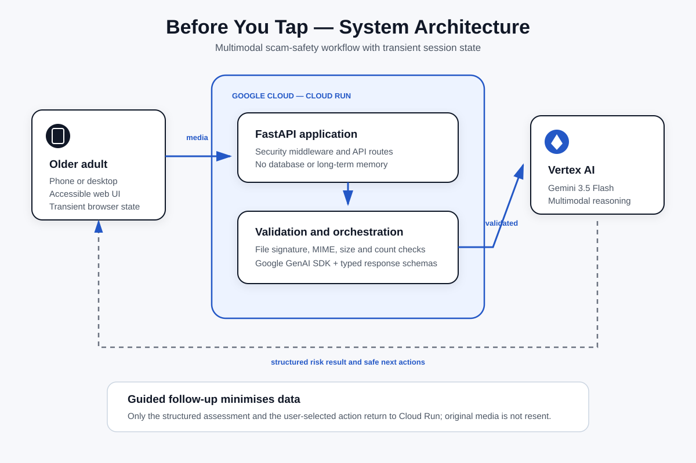

# Before You Tap


**Check suspicious messages and voice notes before you respond, pay, or share details.**

[Live Cloud Run demo](https://before-you-tap-484523463568.australia-southeast1.run.app) ·
[Architecture](docs/ARCHITECTURE.md)

- **Hackathon:** All Things Agentic Hackathon
- **Track:** The Collaborative Partner
- **Project start date:** 26 August 2026
- **Status:** image, camera, saved-audio, Gemini risk analysis, guided follow-up, and
  mobile-first accessible results are working on Cloud Run

## The problem

Scam messages often succeed by creating urgency, fear, or confusion before a person has time to
verify what they are being told. Before You Tap helps an older adult check what looks suspicious
and decide what to do before they tap a link, call back, pay, or share private information.

The user selects suspicious content. Gemini then performs a structured multimodal safety workflow:

1. check whether the supplied content is usable and related;
2. extract the visible or audible evidence;
3. classify the risk as **Low concern**, **Be careful**, or **High risk**;
4. explain the concrete warning signs and uncertainty in plain English;
5. choose safe next steps and only the follow-up actions relevant to the situation; and
6. adapt the next instructions to the action the user says they have already taken.

This is decision support, not a guarantee that a message is safe or fraudulent.

## Working features

### Image checks

- Take a photo on a supported phone or computer camera.
- Choose, drag, or paste up to five ordered JPEG, PNG, or WebP pages from the same message.
- Analyse the pages together while detecting accidentally unrelated items.
- Reorder or remove pages before sending them.

### Saved-audio checks

- Choose or drag one existing MP3, M4A, WAV, OGG, or WebM voicemail or voice message.
- Preview the selected recording before analysis.
- Analyse audible scam signals without monitoring a live call or activating a microphone.

### Accessible results and guided follow-up

- Show the risk level, immediate next steps, and a short summary before the detailed report.
- Communicate risk with text and structure, not colour alone.
- Offer only controlled, context-relevant follow-up choices such as **I clicked the link** or
  **I shared private information**.
- Send only the structured assessment and selected action during follow-up; the original media is
  not sent again.
- Read page guidance aloud with browser speech synthesis where supported.

## Required Google stack

- **Model:** Gemini 3.5 Flash through Vertex AI
- **Google agent framework:** Google GenAI SDK for Python (`google-genai`)
- **Google Cloud infrastructure:** Cloud Run
- **Backend:** Python 3.12 and FastAPI
- **Frontend:** responsive HTML, CSS, and JavaScript
- **State:** transient browser-session state only; no database or long-term memory

No external datasets are used. The model receives only the fictional or user-selected media for
the current check and the safety instructions defined in this repository.

## Architecture



The full data-flow and trust-boundary explanation is in
[`docs/ARCHITECTURE.md`](docs/ARCHITECTURE.md).

## Run locally

### Prerequisites

- Python 3.12
- A Gemini API key from Google AI Studio **or** a Google Cloud project with Vertex AI enabled
- Google Cloud CLI (`gcloud`) only when using Vertex AI or deploying to Cloud Run

### 1. Install the application

```bash
git clone https://github.com/calebily/before-you-tap.git
cd before-you-tap
python3 -m venv .venv
source .venv/bin/activate
python -m pip install -r requirements.txt -r requirements-dev.txt
cp .env.example .env
```

### 2A. Configure Google AI Studio for local development

Edit `.env` without committing it:

```dotenv
GOOGLE_GENAI_USE_VERTEXAI=false
GOOGLE_API_KEY=YOUR_GEMINI_API_KEY
GEMINI_MODEL=gemini-3.5-flash
```

### 2B. Or configure Vertex AI with Application Default Credentials

```bash
gcloud auth application-default login
gcloud auth application-default set-quota-project YOUR_PROJECT_ID
```

Then edit `.env`:

```dotenv
GOOGLE_GENAI_USE_VERTEXAI=true
GOOGLE_CLOUD_PROJECT=YOUR_PROJECT_ID
GOOGLE_CLOUD_LOCATION=global
GEMINI_MODEL=gemini-3.5-flash
```

The `.env` file and Application Default Credentials must never be committed or shared.

### 3. Start and test

```bash
uvicorn app.main:app --reload --port 8080
```

Open <http://localhost:8080>. The health endpoint is
<http://localhost:8080/api/health>.

Run the automated tests:

```bash
pytest
```

### Optional phone testing on the same Wi-Fi

```bash
uvicorn app.main:app --reload --host 0.0.0.0 --port 8080
ipconfig getifaddr en0
```

On the phone, open `http://YOUR-MAC-IP:8080`. Keep the Mac awake and allow incoming connections
if macOS asks. Camera access normally requires HTTPS, so use the deployed Cloud Run URL for the
most reliable mobile camera test.

## Deploy to Cloud Run

The deploying account needs permission to build and deploy Cloud Run services. The runtime service
account needs `roles/aiplatform.user` so it can call Vertex AI without a stored API key.

```bash
gcloud auth login
gcloud config set project YOUR_PROJECT_ID

gcloud services enable \
  aiplatform.googleapis.com \
  artifactregistry.googleapis.com \
  cloudbuild.googleapis.com \
  run.googleapis.com

gcloud run deploy before-you-tap \
  --source . \
  --region australia-southeast1 \
  --allow-unauthenticated \
  --min-instances 0 \
  --max-instances 3 \
  --set-env-vars GOOGLE_GENAI_USE_VERTEXAI=true,GOOGLE_CLOUD_PROJECT=YOUR_PROJECT_ID,GOOGLE_CLOUD_LOCATION=global,GEMINI_MODEL=gemini-3.5-flash
```

For a dedicated runtime identity, add
`--service-account YOUR_RUNTIME_SERVICE_ACCOUNT_EMAIL` to the deploy command after granting that
identity `roles/aiplatform.user` on the project.

After deployment, test the returned service URL and its `/api/health` endpoint. The health response
does not expose credentials and confirms the selected model, provider, and cloud configuration.

## Privacy, security, and failure handling

- Do not commit credentials, real private messages, or real voicemail files.
- Uploaded content is processed in memory for the current request and is not intentionally retained
  by the application.
- Uploaded media is restricted by count, total size, declared MIME type, and file signature.
- API responses use `Cache-Control: no-store`.
- Browser protections include a restrictive Content Security Policy, clickjacking protection,
  MIME-sniffing protection, a no-referrer policy, and a minimal Permissions Policy.
- Cross-origin browser requests to state-changing API routes are rejected. Cloud Run maximum
  instances and Google Cloud spending controls provide additional cost protection.
- Gemini output is validated against strict Pydantic schemas and inserted into the page as text,
  never executable HTML.
- Model, configuration, validation, and unreadable-file failures return clear error messages rather
  than fabricated safety results.

## Repository layout

```text
app/                 FastAPI application and accessible web UI
app/services/        File validation, Gemini analysis, and guided follow-up
docs/                Architecture diagram and system explanation
tests/               Automated unit and API tests
```

## Development and reuse disclosure

Before You Tap was newly created during the hackathon submission period. OpenAI Codex was used as
an AI coding assistant. Product direction, safety decisions, acceptance testing, and the final
submission remain the entrant's responsibility. No pre-existing proprietary project code or
external dataset was incorporated. Open-source Python packages are used under their respective
licenses.
