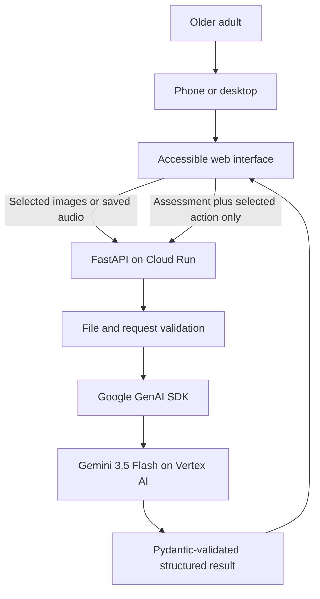

# Architecture

Before You Tap is a stateless, multimodal web agent deployed as one Cloud Run service. The browser
holds the current assessment only for the active page session. No database or long-term user memory
is used in the MVP.

The upload and guided follow-up paths share the same Cloud Run backend but minimise the data sent
at each step:

1. The browser sends only files explicitly selected by the user.
2. FastAPI rejects unsupported, mismatched, empty, or oversized input before model analysis.
3. The Google GenAI SDK sends valid multimodal content to Gemini 3.5 Flash through Vertex AI.
4. Gemini returns a typed risk assessment: risk level, summary, warning signs, uncertainty, safe
   next steps, and the small set of follow-up actions relevant to the evidence.
5. Pydantic validates the result before the frontend renders it as text.
6. If the user selects a follow-up action, the browser sends only that action and the structured
   assessment. The original image or audio is not resent.

## Trust boundaries and state

| Boundary | Control |
| --- | --- |
| Browser to Cloud Run | HTTPS in production, same-origin mutating API requests, request-size preflight |
| Uploaded media | Count, total-size, MIME allowlist, and file-signature validation |
| Backend to Vertex AI | Cloud service identity / Application Default Credentials; no frontend key |
| Model output to UI | Strict response schema, Pydantic validation, text-only DOM insertion |
| Current assessment | Transient browser memory; removed on refresh and not written to a database |

## Failure handling

- Invalid files are rejected before Gemini is called.
- Missing AI configuration returns a controlled service error.
- Empty or schema-invalid model output is rejected rather than displayed.
- The safety prompts require uncertainty to be stated and prohibit definitive fraud or safety
  claims.
- Cloud Run scales to zero when idle and is capped at a small number of instances to limit cost
  exposure.

## Privacy boundary

The application does not intentionally store uploaded media, generated transcripts, or assessments.
Cloud provider processing and operational logs remain subject to the configured Google Cloud
project and its policies.
